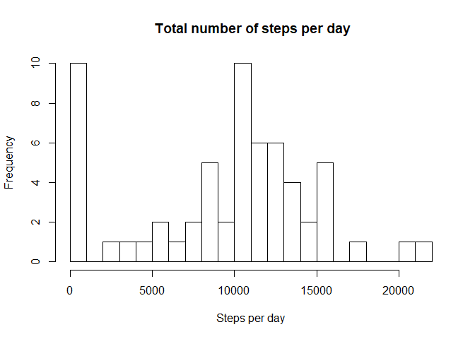
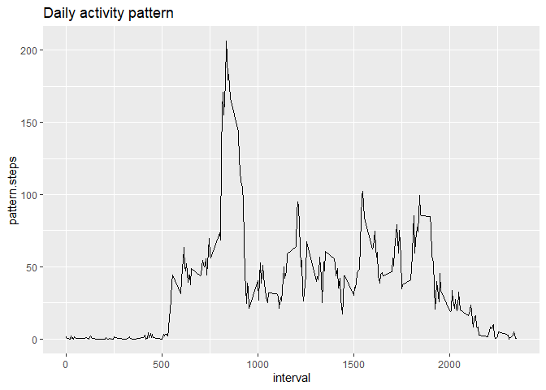
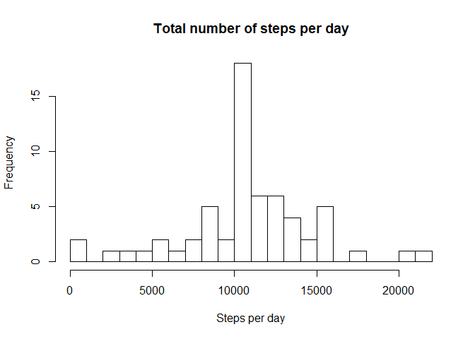
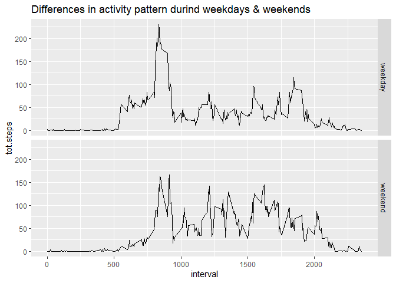

## Loading and preprocessing the data

```r
activity.data <- read.csv('D:/A/activity.csv')
```


1.1 & 1.2 Calculate total number of steps per day.

```r
library(dplyr)
```

```
## 
## Attaching package: 'dplyr'
```

```
## The following objects are masked from 'package:stats':
## 
##     filter, lag
```

```
## The following objects are masked from 'package:base':
## 
##     intersect, setdiff, setequal, union
```

```r
steps <- activity.data %>%select(date,steps)%>% group_by(date) %>% summarise(total.steps = sum(steps, na.rm=TRUE))
hist(steps$total.steps, main=" Total number of steps per day", xlab='Steps per day', breaks = 20)
```

<!-- -->

1.3 Calculate mean and median of total steps taken per day

```r
mean(steps$total.steps)
```

```
## [1] 9354.23
```


```r
median(steps$total.steps)
```

```
## [1] 10395
```


2.1 Daily activity pattern

```r
library(ggplot2)
pattern <- activity.data %>% select(steps, interval) %>% group_by(interval) %>% summarise(pattern.steps = mean(steps, na.rm=TRUE))
ggplot(data= pattern, aes(x=interval, y=pattern.steps)) + geom_line()+ labs( title= 'Daily activity pattern')
```

<!-- -->

2.2 Maximum steps interval

```r
pattern[which.max(pattern$pattern.steps),]
```

```
## # A tibble: 1 x 2
##   interval pattern.steps
##      <int>         <dbl>
## 1      835          206.
```


3.1 Imputing missing values

```r
act.no.na <- activity.data[which(!is.na(activity.data$steps)),]

by.interval <- act.no.na %>% group_by(interval) %>% summarise(avg= mean(steps))

by.interval$avg <- as.numeric(by.interval$avg)

act.na <- activity.data[which(is.na(activity.data$steps)),]

act.na$steps <- ifelse(act.na$interval==by.interval$interval, by.interval$avg)

activity.new.data <- rbind(act.na,act.no.na)
```

Histogram of number of steps per day of new data

```r
steps.new <- activity.new.data %>% select(date,steps)%>%group_by(date) %>% summarise(total.steps = sum(steps))
hist(steps.new$total.steps,  main= "Total number of steps per day", xlab='Steps per day', breaks = 20)
```

<!-- -->

Mean and Median steps of new data

```r
mean(steps.new$total.steps)
```

```
## [1] 10766.19
```


```r
median(steps.new$total.steps)
```

```
## [1] 10766.19
```

3.2 Calculating total number of missing values


```r
missing.values <- sum(is.na(activity.data$steps))
missing.values
```

```
## [1] 2304
```

4 Are there differences in activity patterns between weekdays and weekends?

```r
activity.new.data$weekday <- weekdays(as.Date(activity.new.data$date))
activity.new.data$weekend <- as.factor(activity.new.data$weekday=='Saturday'|activity.new.data$weekday=='Sunday')
levels(activity.new.data$weekend)<- c('weekday','weekend')
```

Seperate data for weekend & weekday

```r
act.weekday <- activity.new.data[activity.new.data$weekend=='weekday',]
act.weekend <- activity.new.data[activity.new.data$weekend=='weekend',]
```

Finding mean steps of each data set created above

```r
weekday.steps <- act.weekday %>% group_by(interval) %>% summarise(tot.steps = mean(steps))%>% mutate(weekend='weekday')
weekend.steps <- act.weekend %>% group_by(interval) %>% summarise(tot.steps= mean(steps))%>% mutate(weekend='weekend')
```

Plotting differences in pattern during weekdays & weekends

```r
pattern.week <- rbind(weekday.steps, weekend.steps)
library(ggplot2)
ggplot(data= pattern.week, aes(interval, tot.steps))+ geom_line()+ facet_grid(weekend~.)+ labs(xlab= 'interval', title='Differences in activity pattern durind weekdays & weekends')
```

<!-- -->
